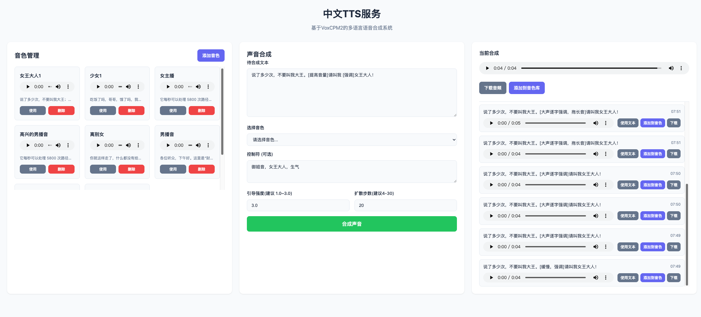

# Chinese TTS Service

基于 [VoxCPM2](https://github.com/OpenBMB/VoxCPM) 的中文语音合成服务，支持 30 种语言和语音克隆。


## 特性

- **多语言支持**：支持 30 种语言的语音合成
- **语音克隆**：通过参考音频实现音色克隆
- **高保真输出**：48kHz 音频输出
- **队列机制**：支持并发请求，自动排队处理
- **风格控制**：通过 `control` 参数控制合成风格

## 快速开始

### 安装依赖

```bash
uv sync
```

### 启动服务

```bash
uv run main.py
```

服务启动后访问 http://localhost:8000/docs 查看 API 文档。

## API 接口

| 方法 | 路径 | 说明 |
|------|------|------|
| GET | `/api/v1/voices` | 获取所有音色 |
| POST | `/api/v1/voices` | 添加音色 |
| DELETE | `/api/v1/voices/:id` | 删除音色 |
| POST | `/api/v1/synthesize` | 合成语音 |
| GET | `/api/v1/model/status` | 获取模型状态 |
| POST | `/api/v1/model/unload` | 卸载模型释放内存 |
| GET | `/health` | 健康检查 |

### GET /api/v1/voices

获取所有已添加的音色列表。

**响应字段说明：**

| 字段 | 类型 | 说明 |
|------|------|------|
| `id` | string | 音色唯一标识符 |
| `name` | string | 音色名称 |
| `voice_url` | string | 参考音频的外链 URL |
| `text` | string | 参考音频对应的文本内容 |

**响应示例：**
```json
[
  {
    "id": "a1b2c3d4",
    "name": "少女音",
    "voice_url": "http://localhost:8000/voices/a1b2c3d4.wav",
    "text": "今天天气真好"
  }
]
```

### POST /api/v1/voices

添加新的音色（语音克隆）。

**请求字段说明：**

| 字段 | 类型 | 必填 | 说明 |
|------|------|------|------|
| `name` | string | 是 | 音色名称，如"少女音"、"大叔音" |
| `voice` | string | 是 | 参考音频的 data-URI 格式（`data:audio/wav;base64,...`）|
| `text` | string | 是 | 参考音频对应的文本内容 |

**响应字段说明：**

| 字段 | 类型 | 说明 |
|------|------|------|
| `id` | string | 音色唯一标识符 |
| `name` | string | 音色名称 |
| `voice_url` | string | 参考音频的外链 URL |
| `text` | string | 参考音频对应的文本内容 |

**示例：**
```bash
curl -X POST http://localhost:8000/api/v1/voices \
  -H "Content-Type: application/json" \
  -d '{
    "name": "少女音",
    "voice": "data:audio/wav;base64,...",
    "text": "参考音频的文本内容"
  }'
```

### DELETE /api/v1/voices/{voice_id}

删除指定音色的所有数据（音频文件和元数据）。

**路径参数：**

| 参数 | 类型 | 说明 |
|------|------|------|
| `voice_id` | string | 要删除的音色 ID |

**响应：**
```json
{
  "message": "Voice 'a1b2c3d4' deleted successfully"
}
```

### POST /api/v1/synthesize

合成语音并返回音频文件。

**请求字段说明：**

| 字段 | 类型 | 必填 | 说明 |
|------|------|------|------|
| `text` | string | 是 | 要合成的文本内容 |
| `voice_id` | string | 否 | 音色 ID，不提供则使用默认音色 |
| `control` | string | 否 | 风格控制字符串，如"(happy)" |
| `speed` | float | 否 | 语速控制（暂未实现）|
| `cfg_value` | float | 否 | CFG 引导强度，范围 0.0-3.0，默认为 1.0 |
| `inference_timesteps` | int | 否 | 推理步数，值越大质量越高但速度越慢，默认为 20 |
| `output_format` | string | 否 | 输出格式，`wav`（默认）或 `mp3` |

**响应：** 音频文件（默认 `audio/wav`，可通过 `output_format` 指定为 `audio/mpeg`）

**示例：**
```bash
# 返回 WAV（默认）
curl -X POST http://localhost:8000/api/v1/synthesize \
  -H "Content-Type: application/json" \
  -d '{
    "text": "今天天气真好",
    "voice_id": "a1b2c3d4",
    "cfg_value": 1.0,
    "inference_timesteps": 20
  }' \
  -o synthesized.wav

# 返回 MP3
curl -X POST http://localhost:8000/api/v1/synthesize \
  -H "Content-Type: application/json" \
  -d '{
    "text": "今天天气真好",
    "voice_id": "a1b2c3d4",
    "output_format": "mp3"
  }' \
  -o synthesized.mp3
```

### GET /api/v1/model/status

获取模型加载状态和任务队列信息。

**响应字段说明：**

| 字段 | 类型 | 说明 |
|------|------|------|
| `loaded` | bool | 模型是否已加载到内存 |
| `busy` | bool | 是否有任务正在执行 |
| `queue_size` | int | 队列中待处理的任务数量 |

**响应：**
```json
{
  "loaded": true,
  "busy": false,
  "queue_size": 0
}
```

### POST /api/v1/model/unload

卸载模型释放内存。模型忙碌时（正在合成）无法卸载。

**响应字段说明：**

| 字段 | 类型 | 说明 |
|------|------|------|
| `unloaded` | bool | 是否成功卸载 |

**响应：**
```json
{
  "unloaded": true
}
```

**错误响应（409 冲突）：**
```json
{
  "detail": "Worker is busy, cannot unload model"
}
```

### GET /health

健康检查接口，用于验证服务是否正常运行。

**响应：**
```json
{
  "status": "healthy"
}
```

## 配置

在 `.env` 文件中设置：

```
MODEL_PATH=pretrained_models/VoxCPM2
VOICES_DIR=voices
BASE_URL=http://localhost:8000
QUEUE_SIZE=10
HOST=0.0.0.0
PORT=8000
LOAD_DENOISER=true
```

**配置项说明：**

| 配置项 | 默认值 | 说明 |
|--------|--------|------|
| `MODEL_PATH` | pretrained_models/VoxCPM2 | 模型文件路径 |
| `VOICES_DIR` | voices | 音色存储目录 |
| `BASE_URL` | http://localhost:8000 | 服务基础URL |
| `QUEUE_SIZE` | 10 | 合成任务队列大小 |
| `HOST` | 0.0.0.0 | 服务监听地址 |
| `PORT` | 8000 | 服务监听端口 |
| `LOAD_DENOISER` | true | 是否加载语音降噪器 |

## 下载模型

```bash
uv run download.py
```

模型将下载到配置文件中指定的 `MODEL_PATH` 目录。

## 音色存储

- 音频文件：`voices/<voice_id>.wav`
- 元数据：`voices/<voice_id>.json`

## 前端界面

服务启动后访问 http://localhost:8000/ 可使用网页界面进行语音合成。
